  

<h1 align="left">Hi 👋, I'm Nicolás Puebla</h1>

A passionate app developer and Software Engineering student.

###  

🔹 App developer focused on clean architectures & intuitive UX 
🔹 Software Engineering student passionate about problem-solving 
🔹 Exploring cybersecurity 
🔹 Lover of pixel art, anime aesthetics & retro technology 
🔹 Always learning — always building 

---

<h2 align="left">Knowledge</h2>

<h3 align="left">Programming Languages</h3>

  
  
  
  
  
  
  

<h3 align="left">Web Development</h3>

  
  
  
  

<h3 align="left">Databases</h3>

  
  
  
  

<h3 align="left">Frameworks</h3>

  
  
  
  

<h3 align="left">Environments</h3>

  
  
  
  
  

<h3 align="left">DevOps & Version Control</h3>

  
  
  
  

---
<!--

### Pac-Man Contribution Graph

<picture>
  <source media="(prefers-color-scheme: dark)"
          srcset="https://raw.githubusercontent.com/Syroko8/Syroko8/output/pacman-contribution-graph-dark.svg">
  <source media="(prefers-color-scheme: light)"
          srcset="https://raw.githubusercontent.com/Syroko8/Syroko8/output/pacman-contribution-graph.svg">
  
</picture>

Metrics:
 -->

  

